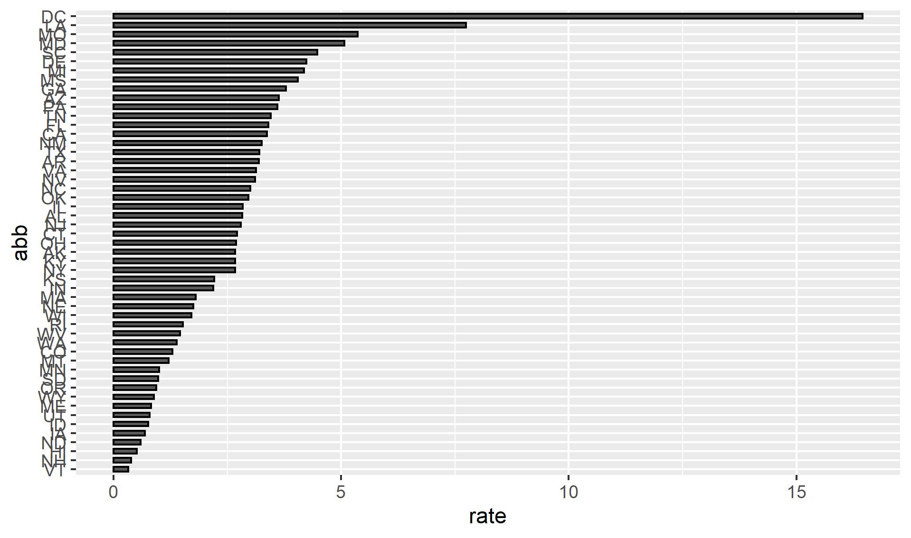

# 🔫 US Gun Murders by State — R Analysis

An end-to-end R project that downloads, wrangles, analyzes, and visualizes US gun murder rates by state using the `dslabs` dataset.

---

## 📊 Output

<p align="center">
  
</p>

*Murder rate per 100,000 population by state, sorted by rate.*

---

## 🔄 Pipeline

| Step | Script | Description |
|------|--------|-------------|
| 1. Download | `download_data.R` | Fetches raw CSV from the `dslabs` GitHub repo |
| 2. Wrangle | `wrangle_dat.R` | Adds region factor and computes murder rate per 100k |
| 3. Analyze | `analysis.R` | Generates a horizontal bar plot of murder rates by state |
| 4. Report | `reports/report.Rmd` | R Markdown report summarizing findings |

---

## 📁 Project Structure

```
murders/
├── data/murders.csv          # Raw data
├── rda/murders.rda           # Cleaned R data object
├── figs/barplots.png         # Output visualization
├── reports/report.Rmd        # R Markdown report
├── download_data.R           # Step 1 — download
├── wrangle_dat.R             # Step 2 — wrangle
├── analysis.R                # Step 3 — analyze & plot
└── murders.Rproj             # RStudio project file
```

---

## 🛠️ Tech Stack

<p>
  
  
  
  
  
</p>

---

## 🚀 Getting Started

```r
# In RStudio, open murders.Rproj then run:
source("download_data.R")
source("wrangle_dat.R")
source("analysis.R")
```

---

## 👤 Author

**Ali Trabelsi Karoui** — [LinkedIn](https://www.linkedin.com/in/ali-trabelsi-karoui-226990151/) · [Email](mailto:alitrabelsikaroui2293@gmail.com)
